# Naive RAG with RAGAS Evaluation

Educational project demonstrating how to build a **Retrieval-Augmented Generation (RAG)** pipeline and evaluate it using **RAGAS** metrics with **Quality Gates**.

## Key Insight: Model Quality Matters

This project proves that **LLM quality directly impacts RAG output quality**. Using the same pipeline, same document, same questions — only changing the model:


| Metric | Small Model (qwen2.5:3b) | Large Model (Claude) | Improvement |
|--------|--------------------------|----------------------|-------------|
| **Faithfulness** | 0.483 | 0.839 | **+74%** |
| **Answer Relevancy** | 0.898 | 0.973 | **+8%** |
| **Average Score** | 0.691 | 0.906 | **+31%** |

**Bottom line**: Without quality gates, you don't know what you're putting in production.

## What You'll Learn

1. **Document Ingestion**: Load PDFs and split into chunks
2. **Vector Store**: Create embeddings with local Nomic model and index with FAISS
3. **RAG Pipeline**: Retrieve context and generate answers (Ollama or Claudex)
4. **RAGAS Evaluation**: Measure quality with automated metrics
5. **Quality Gates**: Automated thresholds for production readiness

## Pipeline Architecture

```mermaid
flowchart TB
    subgraph INPUT["📄 Input Layer"]
        A[("PDF Document<br/>Bitcoin Whitepaper")]
    end

    subgraph INGESTION["🔧 Ingestion Pipeline"]
        B["Document Loader<br/>PyPDF"]
        C["Text Splitter<br/>500 chars / 100 overlap"]
        D[("58 Chunks<br/>Avg: 425 chars")]
    end

    subgraph EMBEDDING["🧠 Embedding Layer"]
        E["Local Embeddings<br/>Nomic via TEI"]
        F[("FAISS Index<br/>Vector Store")]
    end

    subgraph RAG["⚡ RAG Pipeline"]
        G["Query Processing"]
        H["Semantic Search<br/>k=4 documents"]
        I["Context Assembly"]
        J["LLM Generation<br/>Claude via Claudex"]
    end

    subgraph QUALITY["🎯 Quality Gates"]
        K{{"RAGAS Evaluation"}}
        L["Faithfulness<br/>Score: 0.839 ✅"]
        M["Answer Relevancy<br/>Score: 0.973 ✅"]
        N["Average: 0.906<br/>PASSED ✅"]
    end

    subgraph OUTPUT["📊 Output"]
        O[("Quality Report<br/>CSV Export")]
    end

    A --> B --> C --> D
    D --> E --> F
    F --> G --> H --> I --> J
    J --> K
    K --> L & M
    L & M --> N --> O

    style INPUT fill:#312e81,stroke:#6366f1,color:#e0e7ff
    style INGESTION fill:#78350f,stroke:#f59e0b,color:#fef3c7
    style EMBEDDING fill:#064e3b,stroke:#10b981,color:#d1fae5
    style RAG fill:#1e3a8a,stroke:#3b82f6,color:#dbeafe
    style QUALITY fill:#831843,stroke:#ec4899,color:#fce7f3
    style OUTPUT fill:#4c1d95,stroke:#8b5cf6,color:#f3e8ff
```



## Quality Gate Decision Framework

```mermaid
flowchart TD
    START(("RAG<br/>Response")) --> EVAL{"RAGAS<br/>Evaluation"}

    EVAL --> F{"Faithfulness<br/>≥ 0.7?"}
    EVAL --> R{"Relevancy<br/>≥ 0.8?"}

    F -->|"✅ Yes"| F_PASS["Grounded in Context"]
    F -->|"❌ No"| F_FAIL["⚠️ Hallucination Risk"]

    R -->|"✅ Yes"| R_PASS["Answers Question"]
    R -->|"❌ No"| R_FAIL["⚠️ Off-Topic Risk"]

    F_PASS & R_PASS --> GATE{"Quality<br/>Gate"}
    F_FAIL --> RETRY["🔄 Retry with<br/>Better Context"]
    R_FAIL --> RETRY

    GATE -->|"Both Pass"| DEPLOY["✅ Production<br/>Ready"]
    GATE -->|"Any Fail"| INVESTIGATE["🔍 Investigate<br/>& Improve"]

    style START fill:#312e81,stroke:#6366f1,color:#e0e7ff
    style DEPLOY fill:#064e3b,stroke:#10b981,color:#d1fae5
    style RETRY fill:#78350f,stroke:#f59e0b,color:#fef3c7
    style INVESTIGATE fill:#7f1d1d,stroke:#ef4444,color:#fee2e2
```



## Project Structure

```
rag-improve-ragas/
├── bitcoin_paper.pdf      # Source document (Bitcoin whitepaper)
├── main.py                # Main execution script
├── notebook.ipynb         # Interactive Jupyter notebook
├── pyproject.toml         # Python dependencies (uv)
├── src/
│   ├── __init__.py
│   ├── document_loader.py # PDF loading & chunking
│   ├── vector_store.py    # FAISS vector store + TEI embeddings
│   ├── rag_pipeline.py    # Naive RAG (Ollama/Claudex)
│   └── evaluator.py       # RAGAS evaluation wrapper
├── data/                  # Vector store persistence
├── outputs/               # Evaluation results (CSV)
└── docs/                  # Additional documentation
```

## Quick Start (100% Local)

### Prerequisites

- **TEI Server** (Text Embeddings Inference) on port 8080
- **[Claudex](https://github.com/Leeaandrob/claudex)** (Claude CLI wrapper) on port 8081 — or Ollama as fallback

### 1. Setup Environment

```bash
# Using uv (recommended)
uv sync

# Or with pip
pip install -r requirements.txt
```

### 2. Start Local Infrastructure

```bash
# TEI for embeddings (Nomic model)
docker run -p 8080:80 \
  ghcr.io/huggingface/text-embeddings-inference:cpu-1.5 \
  --model-id nomic-ai/nomic-embed-text-v1.5

# Claudex for LLM (optional - falls back to Ollama)
docker run -p 8081:8081 \
  -v ~/.claude:/home/appuser/.claude:ro \
  claudex:latest
```

### 3. Run Evaluation

```bash
uv run python main.py
```

## Technical Stack


## RAGAS Metrics Explained

```mermaid
mindmap
  root((RAGAS<br/>Metrics))
    Faithfulness
      Mede alucinações
      Resposta baseada no contexto?
      Score baixo = Inventando fatos
      Meta: ≥ 0.7
    Answer Relevancy
      Responde à pergunta?
      Foco no objetivo do usuário
      Score baixo = Off-topic
      Meta: ≥ 0.8
    Context Precision
      Chunks relevantes no topo?
      Qualidade do retrieval
      Ranking importa
    Context Recall
      Toda info necessária?
      Cobertura do contexto
      Requer ground truth
```



| Metric | What It Measures | Threshold | Risk if Low |
|--------|------------------|-----------|-------------|
| **Faithfulness** | Is the answer grounded in context? | ≥ 0.7 | Hallucinations |
| **Answer Relevancy** | Does answer address the question? | ≥ 0.8 | Off-topic responses |
| **Context Precision** | Are relevant chunks ranked higher? | ≥ 0.7 | Poor retrieval |
| **Context Recall** | Was all needed info retrieved? | ≥ 0.7 | Missing context |

## Configuration Options

### LLM Selection

```python
# main.py
USE_CLAUDEX = True   # Use Claude via Claudex (recommended)
USE_CLAUDEX = False  # Fallback to Ollama (qwen2.5:3b)
```

### Chunking Parameters

```python
DocumentProcessor(
    chunk_size=500,      # Characters per chunk
    chunk_overlap=100,   # Overlap between chunks
)
```

**Trade-offs:**
- Smaller chunks → More precise retrieval, may lose context
- Larger chunks → More context, may include irrelevant info

### Retrieval Parameters

```python
NaiveRAG(
    k=4,                 # Number of chunks to retrieve
    temperature=0.0,     # LLM determinism (0 = deterministic)
)
```

## Model Comparison

```mermaid
flowchart LR
    subgraph SMALL["🔹 Small Model<br/>qwen2.5:3b"]
        A1["Faithfulness<br/>0.483"]
        A2["Relevancy<br/>0.898"]
        A3["Average<br/>0.691"]
    end

    subgraph IMPROVEMENT["📈 Upgrade Impact"]
        B["Model Quality<br/>Matters!"]
    end

    subgraph LARGE["🔷 Large Model<br/>Claudex"]
        C1["Faithfulness<br/>0.839 (+74%)"]
        C2["Relevancy<br/>0.973 (+8%)"]
        C3["Average<br/>0.906 (+31%)"]
    end

    A1 --> B
    A2 --> B
    A3 --> B
    B --> C1
    B --> C2
    B --> C3

    style SMALL fill:#7f1d1d,stroke:#ef4444,color:#fee2e2
    style IMPROVEMENT fill:#78350f,stroke:#f59e0b,color:#fef3c7
    style LARGE fill:#064e3b,stroke:#10b981,color:#d1fae5
```



## Sample Output

```
============================================================
NAIVE RAG WITH RAGAS EVALUATION
Bitcoin Whitepaper Demo (Local Models)
============================================================

[STEP 1] Document Ingestion
----------------------------------------
Chunk Statistics:
  num_chunks: 58
  avg_length: 425
  min_length: 89
  max_length: 500

[STEP 2] Vector Store Creation
----------------------------------------
[VectorStore] Using local embeddings from TEI at http://localhost:8080

[STEP 3] RAG Pipeline Setup
----------------------------------------
[RAG] Using Claudex at: http://localhost:8081/v1
[RAG] Initialized with k=4

[STEP 5] RAGAS Evaluation
----------------------------------------
[Evaluator] Evaluating 5 samples...

============================================================
RAGAS EVALUATION REPORT
============================================================

FAITHFULNESS: 0.839 [GOOD]
  Measures factual accuracy of the answer based on context...

ANSWER_RELEVANCY: 0.973 [GOOD]
  Measures how relevant the answer is to the question...

============================================================
AVERAGE SCORE: 0.906
============================================================
```

## Experimentation Ideas

1. **Chunk Size**: Try 300, 500, 800, 1000
2. **Chunk Overlap**: Try 50, 100, 200
3. **Retrieval K**: Try 2, 4, 6, 8
4. **Model Comparison**: Ollama vs Claudex
5. **System Prompt**: Modify the RAG prompt
6. **Reranking**: Add a reranker after retrieval

## Troubleshooting

### "Connection refused" on TEI
Ensure TEI server is running:
```bash
curl http://localhost:8080/health
```

### "Connection refused" on Claudex
Claudex is optional. Set `USE_CLAUDEX = False` to use Ollama:
```bash
ollama pull qwen2.5:3b
```

### Low Faithfulness Score
- Increase `k` for more context
- Decrease `chunk_size` for more precise retrieval
- Use a larger LLM model

### Low Answer Relevancy Score
- Improve system prompt
- Use a higher quality model
- Check if retrieval is returning relevant chunks

## References

- [RAGAS Documentation](https://docs.ragas.io/)
- [LangChain Documentation](https://python.langchain.com/)
- [FAISS Documentation](https://faiss.ai/)
- [Text Embeddings Inference](https://github.com/huggingface/text-embeddings-inference)
- [Nomic Embed](https://huggingface.co/nomic-ai/nomic-embed-text-v1.5)
- [Claudex](https://github.com/Leeaandrob/claudex) - OpenAI-compatible API wrapper for Claude CLI
- [Bitcoin Whitepaper](https://bitcoin.org/bitcoin.pdf)

## License

MIT License - Educational use only.
